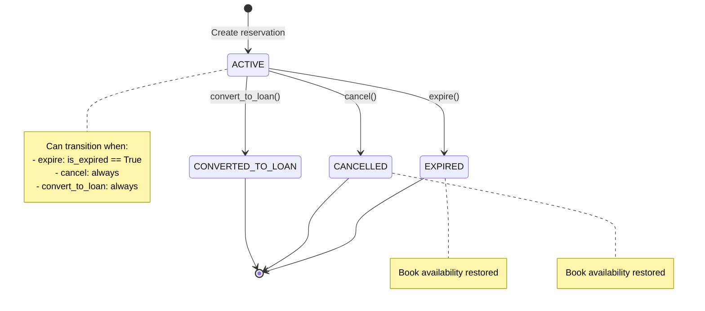
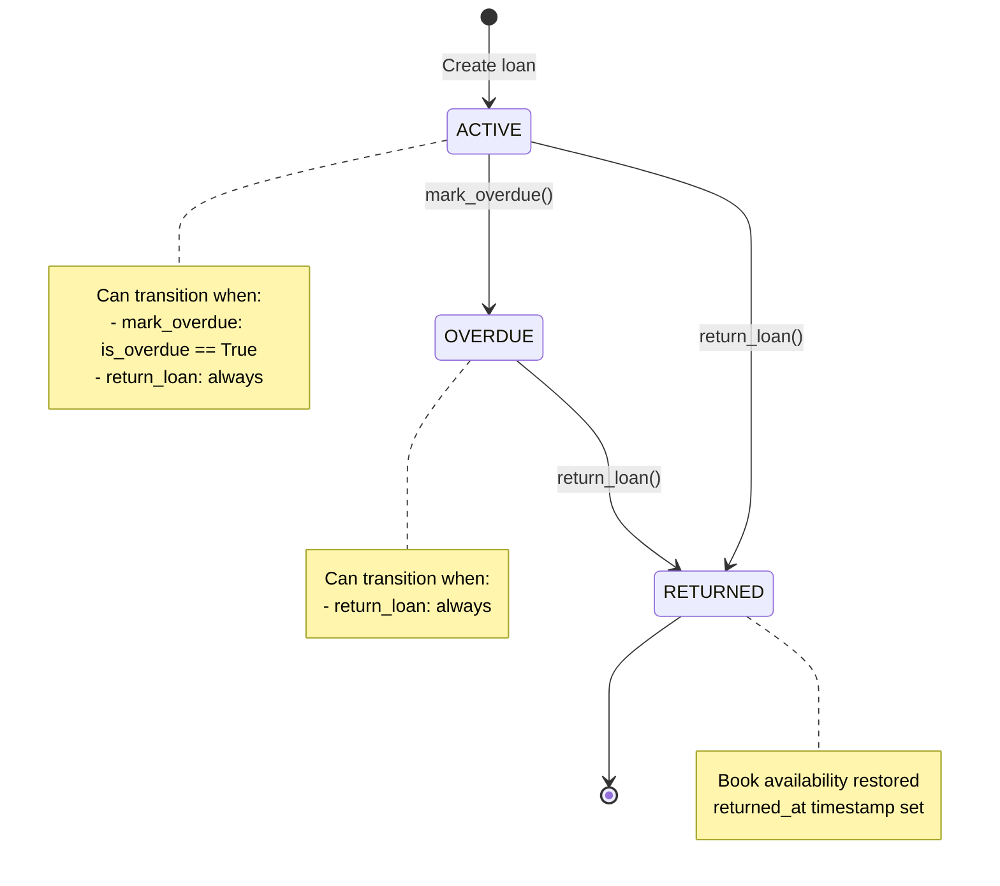

# Finite State Machines - Biblioteca

## Reservation State Machine



### Reservation Transitions

| Transition | Source | Target | Conditions | Side Effects |
|------------|--------|--------|------------|--------------|
| `expire()` | ACTIVE | EXPIRED | `is_expired == True` | Restore book availability (+1) |
| `cancel()` | ACTIVE | CANCELLED | Always allowed | Restore book availability (+1) |
| `convert_to_loan()` | ACTIVE | CONVERTED_TO_LOAN | Always allowed | No change to book availability |

## Loan State Machine



### Loan Transitions

| Transition | Source | Target | Conditions | Side Effects |
|------------|--------|--------|------------|--------------|
| `mark_overdue()` | ACTIVE | OVERDUE | `is_overdue == True` | None |
| `return_loan()` | ACTIVE, OVERDUE | RETURNED | Always allowed | Restore book availability (+1), Set `returned_at` |

## Key Features

### FSM Protection
- State fields are marked as `protected=True`, preventing direct assignment
- State changes must go through transition methods
- Invalid transitions raise `TransitionNotAllowed` exception

### Automatic State Management
- Celery tasks periodically check for overdue loans and expired reservations
- FSM conditions ensure transitions only happen when valid
- All state changes are atomic and logged

### Book Availability Management
- Book availability is automatically updated during state transitions
- Uses database-level operations (`F()` expressions) to prevent race conditions
- Ensures data consistency across concurrent operations

## Example Usage

### Expiring a Reservation
```python
from django_fsm import TransitionNotAllowed

try:
    reservation.expire()  # Transition to EXPIRED
    reservation.save()    # Persist the change
except TransitionNotAllowed:
    # Reservation cannot be expired (not in ACTIVE state or not expired yet)
    pass
```

### Returning a Loan
```python
try:
    loan.return_loan()  # Transition to RETURNED
    loan.save()         # Persist the change
except TransitionNotAllowed:
    # Loan cannot be returned (already returned)
    pass
```

### Checking Available Transitions
```python
# Get all available transitions for current state
from django_fsm import get_available_FIELD_transitions

transitions = get_available_status_transitions(reservation)
for transition in transitions:
    print(f"Can call: {transition.name}")
```
